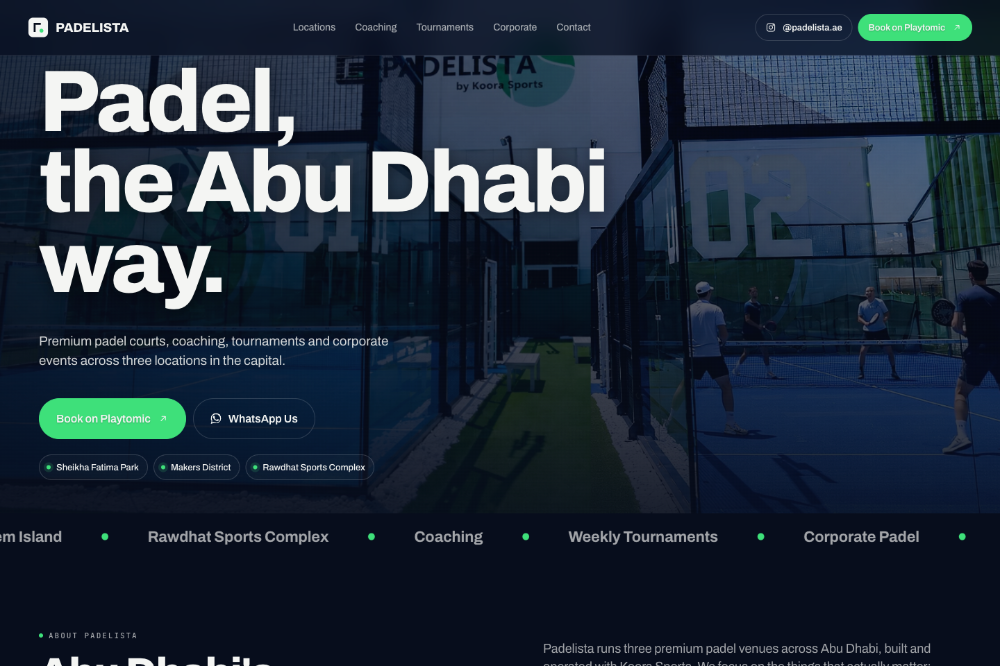
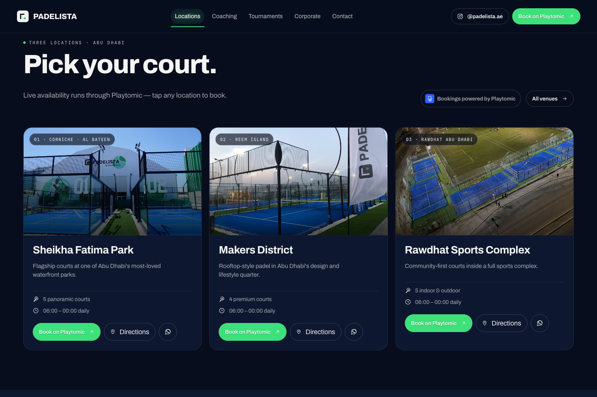
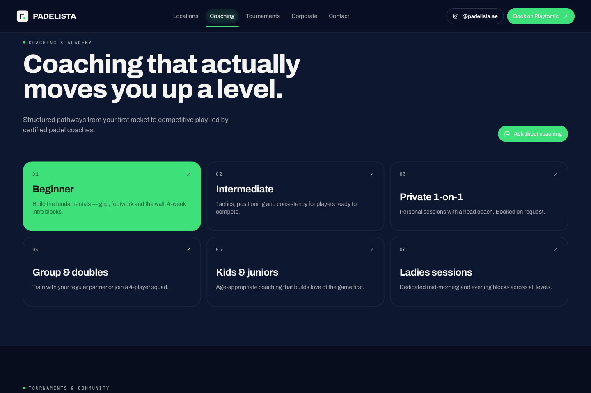
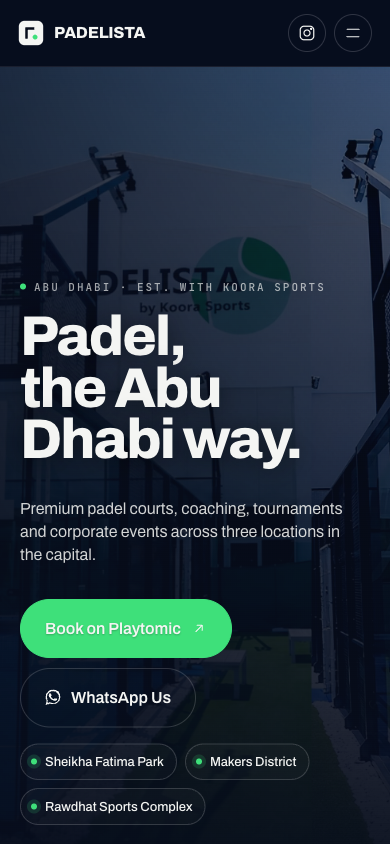

# Padelista

A responsive showcase website for Padelista's padel courts, coaching, and corporate events in Abu Dhabi. The experience combines venue information, court imagery, video, and booking links.

## Preview



<details>
<summary>More previews: venues, coaching, and mobile</summary>

### Venues



### Coaching



### Mobile



</details>

## Features

- Venue sections and maps for the featured Abu Dhabi locations.
- Coaching and event information.
- Court and promotional video media.
- Responsive layouts and external booking links.
- A dedicated mobile preview page.

## Run locally

Requires Python 3 for the example server and a modern browser.

```bash
python3 -m http.server 8000 --bind 127.0.0.1
```

Open [http://localhost:8000](http://localhost:8000). Use `/mobile.html` for the mobile preview. No npm installation or build step is required.

## Implementation

React 18 components load from local JSX files and are compiled in the browser with Babel Standalone. CDN-hosted dependencies require internet access.

- `index.html`: main entry point.
- `padelista-page.jsx`: page composition.
- `padelista-home.jsx` and `padelista-sections.jsx`: primary content sections.
- `padelista-icons.jsx`: interface icons.
- `styles.css`: shared styling.
- `assets/`: venue images, maps, logos, and videos.
- `Padelista.html`: alternate preview with design controls.

## Deployment

Publish the repository root on a static host with `index.html` as the entry point and no build command. Booking takes place through external links; the repository does not include a booking backend.
